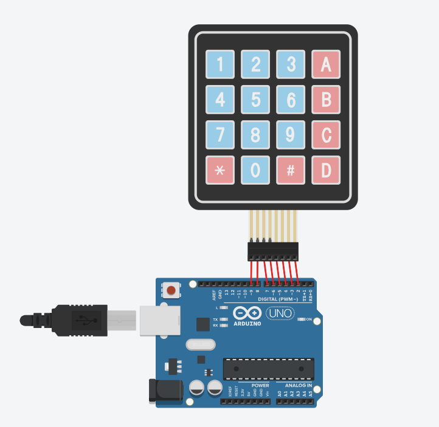

# Arduino Keypad Interfacing

This project demonstrates how to interface a 4x4 matrix keypad with an Arduino to detect key presses and display them in the Serial Monitor. It is useful for applications like digital locks, menu navigation, and user authentication systems.

---

## **Features**
- Detects key presses from a 4x4 matrix keypad.
- Displays the pressed key in the Serial Monitor.
- Simple and configurable pin mapping for rows and columns.

---

## **Hardware Requirements**
- Arduino Board
- 4x4 Matrix Keypad
- Wires

---

## **Circuit Diagram**
| Keypad Pin | Arduino Pin |

|--------------|-------------|

| Row 1 (R1)&nbsp;&nbsp; |&nbsp;&nbsp;&nbsp;&nbsp;&nbsp;&nbsp;9&nbsp;&nbsp;&nbsp;&nbsp;&nbsp;&nbsp;&nbsp;&nbsp;|

| Row 2 (R2)&nbsp;&nbsp; |&nbsp;&nbsp;&nbsp;&nbsp;&nbsp;&nbsp;8&nbsp;&nbsp;&nbsp;&nbsp;&nbsp;&nbsp;&nbsp;&nbsp;|

| Row 3 (R3)&nbsp;&nbsp; |&nbsp;&nbsp;&nbsp;&nbsp;&nbsp;&nbsp;7&nbsp;&nbsp;&nbsp;&nbsp;&nbsp;&nbsp;&nbsp;&nbsp;|

| Row 4 (R4)&nbsp;&nbsp; |&nbsp;&nbsp;&nbsp;&nbsp;&nbsp;&nbsp;6&nbsp;&nbsp;&nbsp;&nbsp;&nbsp;&nbsp;&nbsp;&nbsp;|

| Column 1 (C1)  &nbsp;&nbsp; |&nbsp;&nbsp;&nbsp;&nbsp;&nbsp;&nbsp;5&nbsp;&nbsp;&nbsp;&nbsp;&nbsp;&nbsp;&nbsp;&nbsp;|

| Column 2 (C2) &nbsp;&nbsp; |&nbsp;&nbsp;&nbsp;&nbsp;&nbsp;&nbsp;4&nbsp;&nbsp;&nbsp;&nbsp;&nbsp;&nbsp;&nbsp;&nbsp;|

| Column 3 (C3) &nbsp;&nbsp; |&nbsp;&nbsp;&nbsp;&nbsp;&nbsp;&nbsp;3&nbsp;&nbsp;&nbsp;&nbsp;&nbsp;&nbsp;&nbsp;&nbsp;|

| Column 4 (C4) &nbsp;&nbsp; |&nbsp;&nbsp;&nbsp;&nbsp;&nbsp;&nbsp;2&nbsp;&nbsp;&nbsp;&nbsp;&nbsp;&nbsp;&nbsp;&nbsp;|

---

## **Connection**
The connection is as follows:

