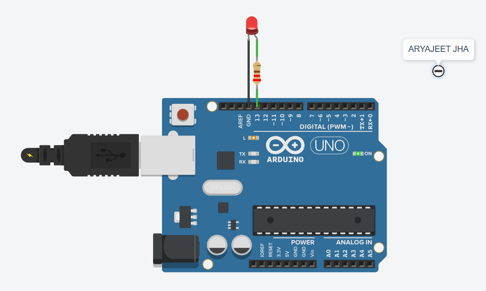

# LED Blink Project

## Overview
This project demonstrates the basic functionality of controlling an LED using an Arduino. The LED blinks on and off at regular intervals, which serves as a great introductory project for beginners learning to use Arduino.

## Components Required
- 1 x Arduino Board (e.g., Arduino Uno)
- 1 x LED
- 1 x 220-ohm Resistor
- Wires

## Circuit Diagram
1. Connect the **anode** (longer leg) of the LED to **pin 13** on the Arduino.
2. Connect the **cathode** (shorter leg) of the LED to one end of the **220-ohm resistor**.
3. Connect the other end of the resistor to the **GND (ground)** pin of the Arduino.

## Simulation

