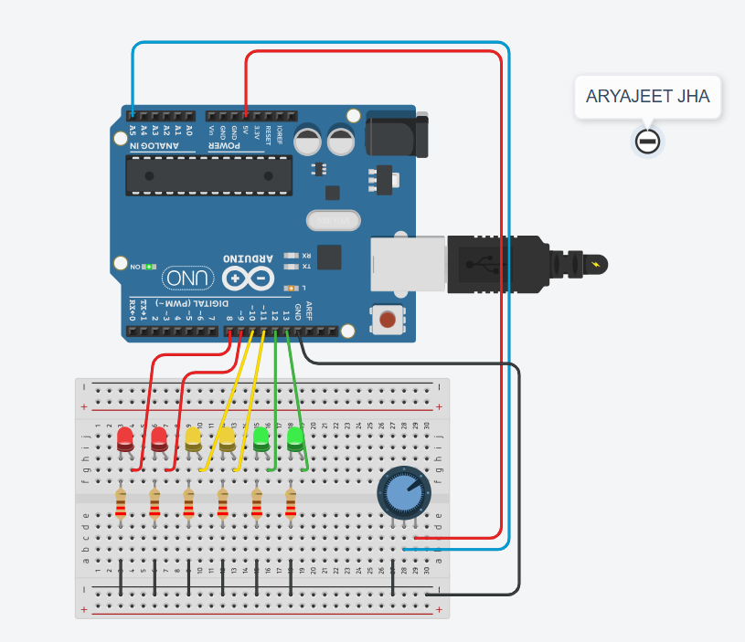

# LED Indicator System with Potentiometer Control

This project uses an Arduino to control a set of LEDs based on the input from a potentiometer. The LEDs light up in different sequences to represent the potentiometer's value, simulating a visual indicator system.

## Project Overview

The system consists of:
- A potentiometer to input analog values.
- Three sets of LEDs (red, yellow, green) to display visual output based on the potentiometer's value.
- The Arduino board to read the potentiometer input and control the LEDs.

### LED Behavior

| Potentiometer Value Range | LED Status        |

|-------------------------------|-------------------|

| 0&nbsp;&nbsp;&nbsp;&nbsp;&nbsp;&nbsp;&nbsp;&nbsp;&nbsp;&nbsp;&nbsp;&nbsp;&nbsp;&nbsp;&nbsp;&nbsp;&nbsp;&nbsp;&nbsp;&nbsp;&nbsp;&nbsp;&nbsp;&nbsp;&nbsp;&nbsp;&nbsp;&nbsp;&nbsp;&nbsp;&nbsp;&nbsp;&nbsp;&nbsp;&nbsp;&nbsp;&nbsp;&nbsp;&nbsp;&nbsp;&nbsp;&nbsp;| All LEDs OFF      |

| 1 - 250&nbsp;&nbsp;&nbsp;&nbsp;&nbsp;&nbsp;&nbsp;&nbsp;&nbsp;&nbsp;&nbsp;&nbsp;&nbsp;&nbsp;&nbsp;&nbsp;&nbsp;&nbsp;&nbsp;&nbsp;&nbsp;&nbsp;&nbsp;&nbsp;&nbsp;&nbsp;&nbsp;&nbsp;&nbsp;&nbsp;&nbsp;&nbsp;&nbsp;| Green LEDs ON     |

| 251 - 500&nbsp;&nbsp;&nbsp;&nbsp;&nbsp;&nbsp;&nbsp;&nbsp;&nbsp;&nbsp;&nbsp;&nbsp;&nbsp;&nbsp;&nbsp;&nbsp;&nbsp;&nbsp;&nbsp;&nbsp;&nbsp;&nbsp;&nbsp;&nbsp;&nbsp;&nbsp;&nbsp;&nbsp;&nbsp;| Yellow LEDs ON    |

| 501 and above&nbsp;&nbsp;&nbsp;&nbsp;&nbsp;&nbsp;&nbsp;&nbsp;&nbsp;&nbsp;&nbsp;&nbsp;&nbsp;&nbsp;&nbsp;&nbsp;&nbsp;&nbsp;&nbsp;&nbsp;| Red LEDs ON       |

## Components Used

- 1 x Arduino Board (e.g., Arduino Uno)
- 1 x Potentiometer
- 2 x Red LEDs
- 2 x Yellow LEDs
- 2 x Green LEDs
- Resistors (220 ohm for LEDs)
- Breadboard and Jumper Wires

## Circuit Diagram

Connect the components as follows:
- **Potentiometer**: Connect one end to 5V, the other to GND, and the middle pin to A5 (analog input pin).
- **Green LEDs**: Connect to digital pins 12 and 13 via 220-ohm resistors.
- **Yellow LEDs**: Connect to digital pins 10 and 11 via 220-ohm resistors.
- **Red LEDs**: Connect to digital pins 8 and 9 via 220-ohm resistors.

